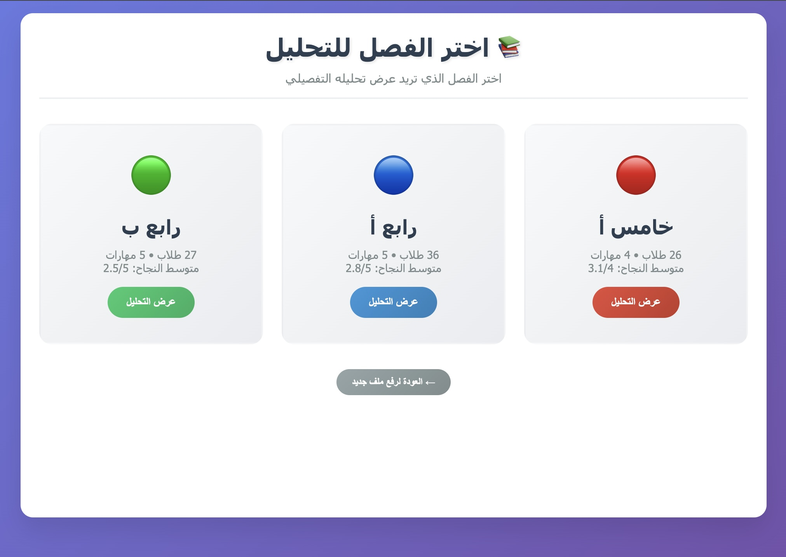
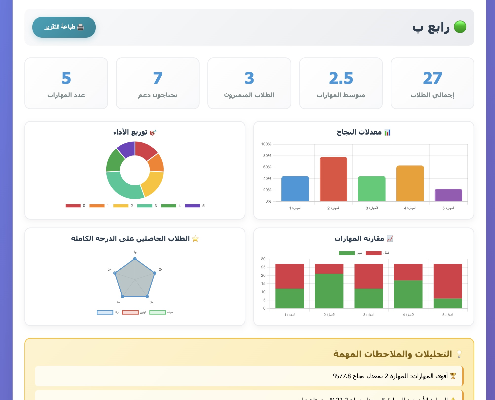

# 🏫 نظام تحليل المهارات للفصول المتعددة

هذا المشروع عبارة عن واجهة ويب تفاعلية تساعد المعلمين على **رفع ملفات بيانات الطلاب (CSV)** وتحليلها بشكل مرئي ومنظم.  
يعرض النظام إحصائيات مفصلة عن أداء الطلاب في المهارات المختلفة باستخدام **الرسوم البيانية والجداول**.

---

## ✨ المميزات
-  **رفع ملفات CSV** عبر السحب والإفلات أو الاختيار اليدوي.
-  **إحصائيات ورسوم بيانية** باستخدام [Chart.js](https://www.chartjs.org/).
-  **تحليل الأداء**: يوضح معدلات النجاح، توزيع الطلاب حسب الأداء، وأقوى وأضعف المهارات.
-  **جدول تفصيلي** يوضح نتائج كل طالب مع تقييم الأداء (متميز، جيد، متوسط، يحتاج دعم).
-  **تحديد الطلاب المتميزين** (الحاصلين على الدرجة الكاملة).
-  **إمكانية طباعة تقرير** كامل مع الرسوم البيانية والجداول.

---

## لقطات شاشة

### صفحة اختيار الفصل

### صفحة تحليل الفصل

---

## 🚀 كيفية الاستخدام
1. افتح الملف `index.html` في متصفحك.
2. من الصفحة الرئيسية:
   - اسحب ملف CSV إلى منطقة الرفع أو اختره يدويًا.
   - يجب أن يحتوي الملف على بيانات الطلاب مرتبة مع الأعمدة الخاصة بالمهارات والفصل.
3. بعد رفع الملف:
   - اختر الفصل المطلوب لتحليل بياناته.
   - ستظهر لك إحصائيات ورسوم بيانية وجداول تفصيلية.
4. يمكنك طباعة التقرير بالنقر على زر 🖨️ "طباعة التقرير".

---

## 📊 شكل البيانات (CSV)
الملف يجب أن يحتوي على أعمدة تمثل:
- اسم الطالب
- نتائج المهارات (0 = لم ينجح، 1 = نجح)
- رمز الفصل (A, B, C)

---

## 🖼️ أمثلة على المخرجات
- **رسم بياني لمعدلات النجاح في المهارات**
- **توزيع الأداء (دونات)**
- **مقارنة النجاح والفشل في كل مهارة**
- **جدول مفصل يوضح أداء الطلاب**

---

## 📌 ملاحظات
- التصميم بالكامل مكتوب بـ **HTML + CSS + JavaScript** (لا يتطلب خادم).
- يمكن رفع بيانات مختلفة بسهولة عبر ملفات CSV جديدة.
- النظام يعمل باللغة العربية مع دعم اتجاه الكتابة من اليمين لليسار (RTL).

---

## 📄 الترخيص
يمكنك استخدام المشروع وتعديله بحرية للأغراض التعليمية أو البحثية.
